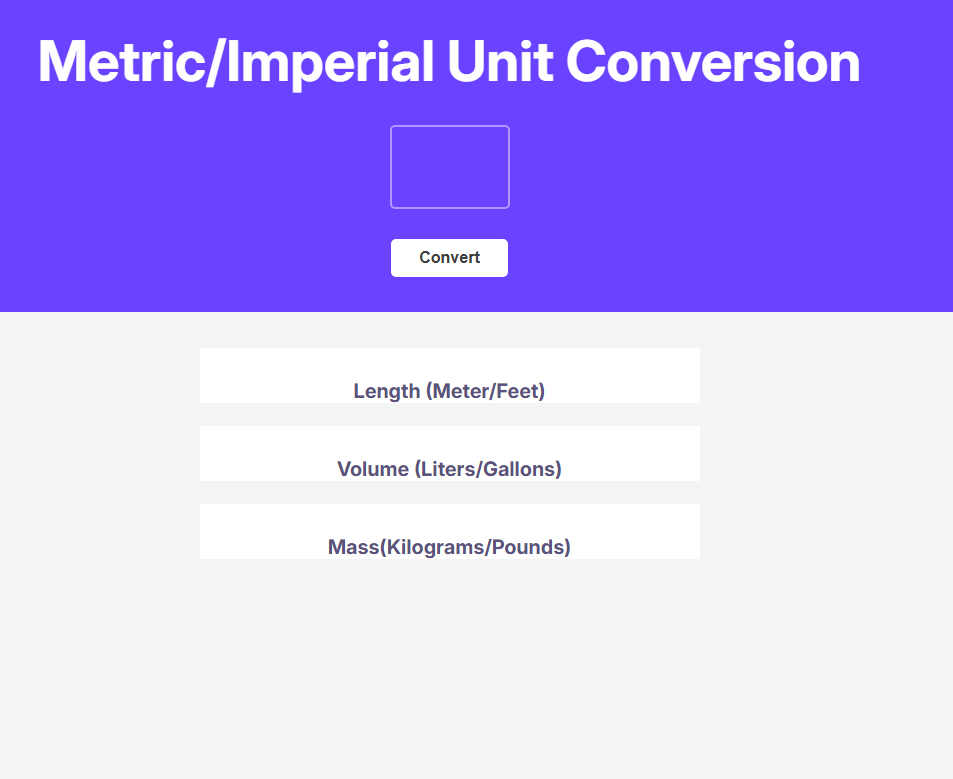
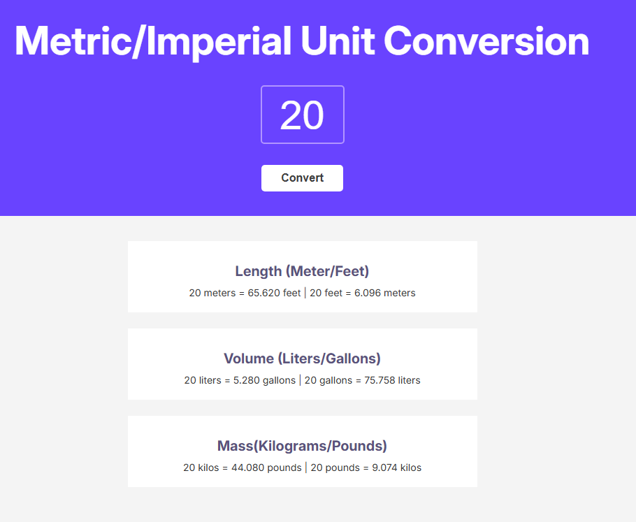

# Simple password generator

This is a project from [Scrimba course](https://scrimba.com/frontend-path-c0j)

### Screenshot

## Table of contents

-   [Screenshot](#screenshot)
-   [Overview](#overview)
    -   [Links](#links)
-   [My process](#my-process)
    -   [Built with](#built-with)

## Overview

A simple unit converter.

### Links

-   Live Site URL: [live site](https://enchanting-pavlova-45a521.netlify.app/)

### Built with

-   Semantic HTML5 markup
-   CSS custom properties
-   Flexbox
